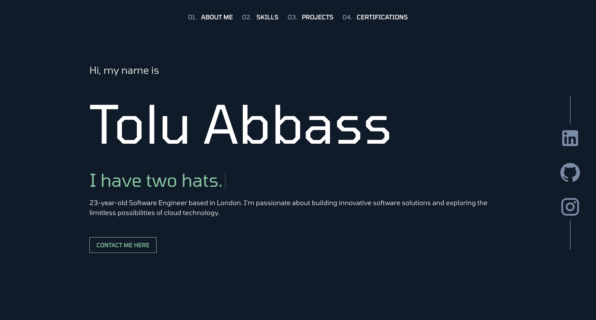

# Portfolio
A personal portfolio project inspired by the Cloud Resume Challenge. This project showcases my skills, creativity, and the ability to build and deploy a modern, responsive website using cutting-edge technologies.

## Table of Contents

1. Inspiration
2. Features
3. Technologies Used
4. Hosting and Deployment
5. How It Works
6. Getting Started
7. Future Improvements
8. Acknowledgments

## Inspiration

This project was inspired by the Cloud Resume Challenge, which I came across from in a YouTube video. The challenge is for people who are looking to create their own cloud projects with little experience. Here is a link for those who may be interested: https://cloudresumechallenge.dev/docs/the-challenge/azure/  I decided to go beyond the original challenge by:

- Using React for a modern and dynamic user experience.
- Incorporating Material UI to streamline the design process with pre-built components.
- Automating deployment with GitHub Actions to implement CI/CD best practices.

Building this project allowed me to combine my knowledge of front-end development with cloud technologies.

## Features

- Fully responsive design to adapt to all screen sizes and devices
- Material UI components for a sleek and professional appearance
- Azure Static Web Hosting for fast and scalable delivery
- GitHub Actions pipeline for seamless deployment automation
- Sections highlighting skills, projects, and contact details

## Technologies Used

- React: Framework for building the website's front end
- Material UI: Library for component-based styling and responsiveness
- Azure Blob Storage: For hosting static files
- GitHub Actions: For creating an automated CI/CD pipeline
- HTML5 & CSS3: Foundational technologies for web development

## Hosting and Deployment

The portfolio website is hosted on Azure Blob Storage with static website hosting enabled. Here's how it works:

- Code changes are pushed to the master branch on GitHub
- A GitHub Actions pipeline triggers the npm run build command to create the production-ready build folder
- The pipeline uploads the contents of the build folder to the $web container in Azure Blob Storage
- Changes are instantly available at the production URL

## Pipeline Workflow

1. On every push to master, GitHub Actions:
- Installs dependencies.
- Builds the production-ready files.
- Uploads the files to Azure Blob Storage.

2.Deployment is automated, eliminating manual steps and speeding up delivery.

